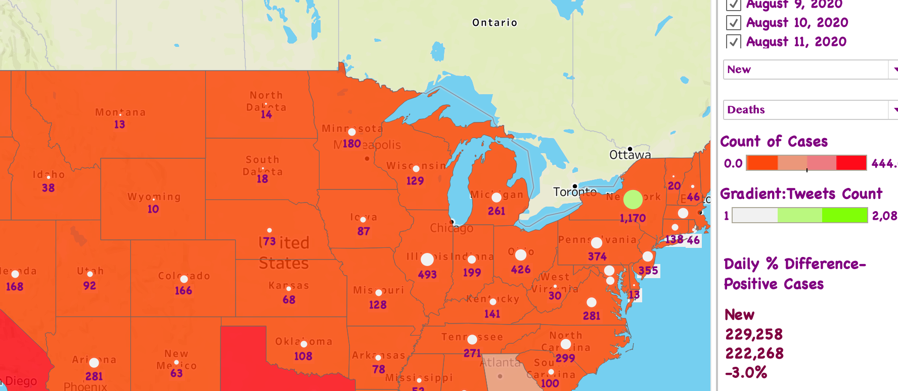

# HashtagAnalysis
### COVID Twitter Hashtag Analysis with a COVID CASES-Heat Map vs. TWITTER COUNT & MOVING AVERAGE LINE CHARTS TO SPOT THE TRENDS.

 Using Twitter Streaming API, Python, and MongoDB, developed a Heat Map and Moving Average trendline charts to spot how trending Twitter Hashtags correlate to the number of COVID cases in the US.

##### Parameters: SET GRADIENT for New+Deaths or Cumulative+Deaths or New+Positive Cases or Cumulative+Positive Cases  &
##### COUNT OF TWEETS FOR TRENDING HASHTAGS are BUBBLED.
##### Moving Average Charts to understand the correlations of Tweet Count & Rising Coronavirus Cases over time.

#### Refer to the tableau public--that has a smaller version of my Design Name: COVID-TWITTER Heat Map & Trajectrories ON
https://public.tableau.com/profile/sindhu8276#!/

##### 
##### 
